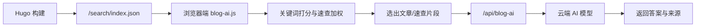

<div align="center">

# 月栖之地

基于 Hugo + Stack 的个人技术博客，面向嵌入式、机器视觉、控制系统与工程笔记沉淀。

站点内置轻量 AI 问答：先检索博客文章与参考速查，再调用云端模型整理答案。

[在线访问](https://xw911-blog.vercel.app/) · [参考速查](https://xw911-blog.vercel.app/reference/) · [归档](https://xw911-blog.vercel.app/archives/) · [GitHub](https://github.com/xw9114/blog)


</div>

## 为什么需要它？

| 能力 | 改变了什么 |
| --- | --- |
| 技术文章沉淀 | 把零散工程经验整理成可归档、可搜索、可持续补充的文章。 |
| 参考速查 | 将 `OpenCV`、`Python`、`C++` 等常用知识做成快速备忘入口，减少重复查资料。 |
| 页面级背景 | 首页、知识、速查、归档、搜索、关于、链接可展示不同背景图，增强站点识别度。 |
| 透明化阅读界面 | 卡片、归档页、AI 面板做半透明处理，让背景图和内容层次同时保留。 |
| 轻量 AI 问答 | 不引入独立知识库服务，直接基于 Hugo 生成的搜索索引完成站内问答。 |
| Vercel 部署 | 静态站点与 Serverless API 放在同一项目内，维护成本低。 |

## 前置要求

- [Hugo Extended](https://gohugo.io/) `>= 0.160`
- Git
- Vercel 账号，用于部署静态站点与 `/api/blog-ai`
- 可兼容 OpenAI Chat Completions 格式的 AI API Key

## 快速开始

```bash
# 1. 克隆项目
git clone https://github.com/xw9114/blog.git
cd blog

# 2. 本地预览
hugo server -D

# 3. 构建静态站点
hugo
```

本地访问地址通常为：

```text
http://localhost:1313/
```

部署到 Vercel 后，需要在环境变量中配置：

| 环境变量 | 说明 |
| --- | --- |
| `AI_API_KEY` | AI 服务密钥，服务端读取，不暴露给浏览器。 |
| `AI_MODEL` | 可选，覆盖默认模型名称。 |
| `BLOG_AI_ALLOWED_ORIGIN` | 可选，限制允许调用 AI API 的站点来源。 |

## 怎么用

| 场景 | 入口 | 说明 |
| --- | --- | --- |
| 写博客文章 | `content/post/` | 使用 Markdown 编写主文章，永久链接为 `/p/:slug/`。 |
| 写知识笔记 | `content/notes/` | 存放笔记型内容，适合阶段性知识整理。 |
| 写参考速查 | `content/reference/` | 存放短平快备忘内容，可被 AI 问答优先检索。 |
| 调整导航 | `config/_default/menu.toml` | 控制侧边栏菜单入口。 |
| 调整背景 | `config/_default/params.toml` | 在 `[backgrounds.pages]` 中绑定不同页面背景图。 |
| 调整样式 | `assets/scss/custom.scss` | 全站透明卡片、背景层、AI 浮窗样式集中在这里。 |
| 调整 AI | `static/js/blog-ai.js` / `api/blog-ai.js` | 前者负责浏览器检索，后者负责服务端模型调用。 |

## AI 问答工作原理



实现分为四层：

1. `layouts/page/search.json` 输出搜索索引，当前包含 `post` 与 `reference`。
2. `static/js/blog-ai.js` 在浏览器端读取索引，按标题、正文、速查来源进行打分。
3. `api/blog-ai.js` 作为 Vercel Serverless API，负责隐藏 API Key 并调用 AI 模型。
4. `layouts/_partials/footer/custom.html` 注入右下角 AI 入口和对话框。

## 项目结构

```text
blog
├─ hugo.toml                    # Hugo 主配置，当前 theme = "Stack"
├─ vercel.json                  # Vercel 部署配置
├─ config/_default/
│  ├─ menu.toml                 # 导航菜单配置
│  └─ params.toml               # 主题参数、背景图、轻量 AI 问答配置
├─ content/                     # 站点内容源文件
│  ├─ post/                     # 主文章内容
│  ├─ notes/                    # 知识笔记
│  ├─ reference/                # 参考速查内容
│  ├─ page/                     # 关于、归档、链接、搜索等独立页面
│  └─ categories/               # 分类页面内容
├─ layouts/                     # 自定义 Hugo 模板覆盖
│  ├─ page/search.json          # AI 与站内搜索共用的索引输出
│  ├─ reference/list.html       # 参考速查列表页
│  ├─ reference/single.html     # 参考速查详情页
│  ├─ _partials/
│  │  ├─ head/custom.html       # 页面背景与 head 注入
│  │  ├─ footer/custom.html     # 轻量 AI 问答入口
│  │  └─ sidebar/left.html      # 左侧栏覆盖
│  └─ _shortcodes/              # 参考速查短代码
│     ├─ ref-card.html
│     └─ ref-cols.html
├─ assets/
│  ├─ scss/custom.scss          # 全站自定义样式、透明卡片、AI 面板样式
│  ├─ img/avatar.jpg            # 头像资源
│  └─ icons/                    # 自定义图标
├─ static/
│  ├─ js/blog-ai.js             # 浏览器端 AI 检索与对话逻辑
│  ├─ images/ai/claude.png      # AI 浮窗头像
│  ├─ images/backgrounds/nav/   # 不同页面的背景图
│  └─ img/avatar.jpg            # 静态头像
├─ api/
│  └─ blog-ai.js                # Vercel Serverless AI 问答接口
├─ data/                        # 数据文件，例如链接数据
├─ archetypes/                  # 新内容模板
├─ themes/Stack/                # 当前使用主题
├─ public/                      # Hugo 构建产物
├─ resources/                   # Hugo 缓存与资源产物
└─ img2ref.py / img2ref_gui.py  # 本地内容辅助脚本
```

## 资源导航

| 需求 | 文件 |
| --- | --- |
| 站点主配置 | `hugo.toml` |
| 导航与主题参数 | `config/_default/` |
| 文章与笔记 | `content/post/`、`content/notes/` |
| 参考速查 | `content/reference/` |
| 页面模板覆盖 | `layouts/` |
| 全站样式 | `assets/scss/custom.scss` |
| AI 前端逻辑 | `static/js/blog-ai.js` |
| AI 服务端接口 | `api/blog-ai.js` |
| 页面背景图 | `static/images/backgrounds/nav/` |

## FAQ

<details>
<summary>这个 AI 和 AnythingLLM 有什么区别？</summary>

当前方案是轻量站内问答：不需要独立数据库和长期运行服务，只使用 Hugo 生成的静态索引做检索，再由 Serverless API 调用模型总结。AnythingLLM 更适合团队知识库、向量检索和长期会话管理。

</details>

<details>
<summary>为什么参考速查也能被 AI 搜到？</summary>

`config/_default/params.toml` 中的 `indexSections = ["post", "reference"]` 会让 Hugo 把文章和速查一起写入 `/search/index.json`。浏览器端检索时还会给 `reference` 结果额外加权。

</details>

<details>
<summary>API Key 会暴露吗？</summary>

不会。浏览器只请求 `/api/blog-ai`，真正的 `AI_API_KEY` 在 Vercel Serverless 环境变量中读取。

</details>

<details>
<summary>新增背景图应该放哪里？</summary>

放到 `static/images/backgrounds/nav/`，然后在 `config/_default/params.toml` 的 `[backgrounds.pages]` 中绑定对应页面路径。

</details>

## Star History

<a href="https://www.star-history.com/#xw9114/blog&Date">
  <picture>
    <source media="(prefers-color-scheme: dark)" srcset="https://api.star-history.com/svg?repos=xw9114/blog&type=Date&theme=dark" />
    <source media="(prefers-color-scheme: light)" srcset="https://api.star-history.com/svg?repos=xw9114/blog&type=Date" />
    
  </picture>
</a>

## 维护原则

- 内容优先放在 `content/`，避免直接改主题源码。
- 主题覆盖优先放在 `layouts/`，样式集中到 `assets/scss/custom.scss`。
- 静态图片与脚本放在 `static/`，由 Hugo 原样输出。
- `public/` 与 `resources/` 通常是构建产物或缓存，不作为主要源文件维护。
- 提交前建议先运行 `hugo`，确认构建没有新增错误。

<div align="center">

[在线访问](https://xw911-blog.vercel.app/) · [GitHub 仓库](https://github.com/xw9114/blog)

</div>
