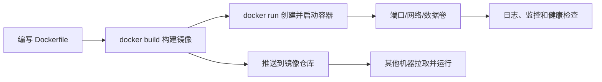

## 写在前面

在没有容器之前，把一个应用部署到另一台机器，往往要重新安装运行时、配置环境变量、准备数据库，再处理一堆“在我电脑上明明可以运行”的问题。Docker 的价值，并不是把应用简单压缩成一个文件，而是把应用及其运行依赖组织成**可复制、可隔离、可版本化的运行单元**。

这篇文章不把 Docker 当成一组需要死记硬背的命令，而是沿着一个完整流程来理解它：

1. Docker 解决了什么问题；
2. 镜像、容器、仓库分别是什么；
3. 如何启动一个现成服务；
4. 如何把自己的应用构建成镜像；
5. 如何用 Docker Compose 管理多个服务；
6. 哪些做法适合开发，哪些做法更适合生产环境。

## 一、Docker 到底是什么

Docker 是一套以容器为核心的应用打包和运行工具。容器会利用 Linux 的命名空间、控制组和分层文件系统，把进程与宿主机上的其他进程隔离开，同时共享宿主机内核。

因此，容器既不是普通的压缩包，也不是一台完整的虚拟机：

| 对比项 | 虚拟机 | 容器 |
| --- | --- | --- |
| 隔离对象 | 虚拟化整台计算机 | 隔离进程、文件系统、网络等资源 |
| 是否包含独立内核 | 通常包含 | 不包含，共享宿主机内核 |
| 启动速度 | 秒到分钟 | 通常为毫秒到秒 |
| 资源开销 | 较高 | 较低 |
| 隔离强度 | 通常更强 | 依赖内核与运行时配置 |
| 典型用途 | 不同操作系统、强隔离场景 | 应用部署、测试环境、微服务 |

容器的隔离性并不意味着它天然安全。容器内的进程仍然使用宿主机的内核，错误的特权配置、危险的挂载和暴露的 Docker Socket 都可能扩大风险。生产环境中应把容器当成一种工程隔离手段，而不是绝对的安全边界。

## 二、镜像、容器和仓库

理解下面三个概念，基本就掌握了 Docker 的主线。

### 1. 镜像：只读的应用模板

镜像（Image）是启动容器所需的只读模板，里面可以包含：

- 基础文件系统，例如 Debian、Alpine 或 Ubuntu 的用户空间；
- 应用程序代码；
- 运行时和依赖，例如 Python、Node.js 或 Nginx；
- 默认启动命令、环境变量和端口元数据。

镜像采用分层存储。Dockerfile 中的每一条常见指令都可能形成一层，未发生变化的层可以被缓存和复用，这就是 Docker 构建速度较快、多个容器可以共享基础文件的原因。

### 2. 容器：镜像的运行实例

容器（Container）是镜像启动后的实例。启动时，Docker 会在镜像的只读层之上增加一个可写层，并为进程配置独立的进程视图、网络和资源限制。

容器的可写层适合存放临时状态，但不适合保存重要数据。删除容器后，这一层通常也会一起消失。数据库文件、上传文件和用户生成内容应该放到数据卷或宿主机绑定目录中。

### 3. 仓库：镜像的分发位置

镜像仓库（Registry）用于存储和分发镜像。Docker Hub 是常见的公共仓库，企业也可以使用私有 Registry。镜像通常使用如下格式标识：

```text
registry.example.com/team/app:1.2.0
```

其中依次是仓库地址、命名空间、镜像名和标签。标签便于人阅读，但它本身不是不可变的；同一个 `latest` 标签在不同时间可能指向不同内容。需要可重复部署时，应使用明确版本或镜像 digest。

## 三、Docker 的基本工作流

一个典型的 Docker 工作流如下：



在现代 Docker Engine 中，命令行客户端会把请求发送给 Docker daemon；daemon 再通过 containerd 和底层 OCI runtime 管理容器的创建、启动、停止和删除。日常使用不必频繁操作这些内部组件，但知道这个关系有助于理解为什么“客户端命令执行失败”和“容器内应用启动失败”是两类不同问题。

## 四、先运行一个现成的 Nginx

安装 Docker Desktop 或 Linux 上的 Docker Engine 后，可以先用 Nginx 验证环境：

```bash
docker run --name demo-nginx -d -p 8080:80 nginx:1.27-alpine
```

这条命令的含义是：

- `run`：根据镜像创建并启动容器；
- `--name demo-nginx`：给容器取一个容易识别的名字；
- `-d`：在后台运行；
- `-p 8080:80`：把宿主机的 8080 端口映射到容器的 80 端口；
- `nginx:1.27-alpine`：使用指定标签的 Nginx 镜像。

浏览器打开 `http://localhost:8080`，如果看到 Nginx 欢迎页，说明容器已经能够对外提供服务。

常用的查看和管理命令如下：

```bash
# 查看正在运行的容器
docker ps

# 查看所有容器，包括已经停止的容器
docker ps -a

# 查看容器日志
docker logs demo-nginx

# 持续跟踪日志
docker logs -f demo-nginx

# 查看容器的端口、挂载和环境等配置
docker inspect demo-nginx

# 在运行中的容器内执行命令
docker exec -it demo-nginx sh

# 停止并删除容器
docker stop demo-nginx
docker rm demo-nginx
```

`docker stop` 只负责停止，`docker rm` 才负责删除。调试时可以保留停止的容器查看日志；确认不再需要后再删除。

## 五、用 Dockerfile 打包自己的应用

下面用一个极简的 Python HTTP 服务演示镜像构建。先创建 `app.py`：

```python
from http.server import BaseHTTPRequestHandler, HTTPServer


class Handler(BaseHTTPRequestHandler):
    def do_GET(self):
        body = b"Hello from Docker\\n"
        self.send_response(200)
        self.send_header("Content-Type", "text/plain; charset=utf-8")
        self.send_header("Content-Length", str(len(body)))
        self.end_headers()
        self.wfile.write(body)


HTTPServer(("0.0.0.0", 8000), Handler).serve_forever()
```

然后在同一目录创建 `Dockerfile`：

```dockerfile
FROM python:3.12-slim

WORKDIR /app
COPY app.py .

EXPOSE 8000
CMD ["python", "app.py"]
```

构建并启动：

```bash
docker build -t hello-docker:1.0 .
docker run --name hello-docker -d -p 8000:8000 hello-docker:1.0
curl http://localhost:8000
```

输出 `Hello from Docker`，就完成了从源代码到容器服务的最小闭环。

### Dockerfile 指令怎么理解

- `FROM`：选择基础镜像；
- `WORKDIR`：设置后续命令的工作目录；
- `COPY`：将构建上下文中的文件复制进镜像；
- `RUN`：在构建阶段执行命令，常用于安装依赖；
- `EXPOSE`：声明应用计划使用的端口，它不会自动完成端口映射；
- `CMD`：容器默认启动命令；
- `ENTRYPOINT`：定义更固定的入口程序，常与 `CMD` 配合使用。

`docker build .` 最后的点表示构建上下文是当前目录。Docker 守护进程可以读取这个上下文中的文件，所以不要把密钥、证书、`.env` 文件和大体积构建产物放进上下文。建议同时创建 `.dockerignore`：

```text
.git
.env
__pycache__
*.log
node_modules
dist
```

## 六、数据卷：让数据脱离容器生命周期

容器应该尽量无状态，但现实中的数据库和上传服务必须保存数据。Docker 提供了命名卷：

```bash
docker volume create demo-db-data
docker run --name demo-mysql \
  -e MYSQL_ROOT_PASSWORD=change-me \
  -e MYSQL_DATABASE=demo \
  -v demo-db-data:/var/lib/mysql \
  -p 3306:3306 \
  -d mysql:8.4
```

`demo-db-data` 是 Docker 管理的命名卷，容器删除后卷仍然存在。查看卷信息：

```bash
docker volume ls
docker volume inspect demo-db-data
```

不要把真实密码长期直接写在命令历史、Dockerfile 或公开的 Compose 文件中。示例中的 `change-me` 只用于演示，实际项目应使用环境变量管理、Secret 机制或专门的密钥管理服务。

## 七、用 Docker Compose 管理多个服务

当项目同时需要应用、数据库和缓存时，一长串 `docker run` 很快就难以维护。Compose 用一个 YAML 文件描述多容器应用，例如：

```yaml
services:
  web:
    build: .
    ports:
      - "8000:8000"
    environment:
      APP_ENV: development
    depends_on:
      - redis

  redis:
    image: redis:7.4-alpine
    volumes:
      - redis-data:/data

volumes:
  redis-data:
```

在该文件所在目录运行：

```bash
# 构建并后台启动
docker compose up -d --build

# 查看服务状态
docker compose ps

# 查看 web 服务日志
docker compose logs -f web

# 停止并删除容器和网络，保留命名卷
docker compose down

# 连同命名卷一起删除，谨慎使用
docker compose down -v
```

Compose 默认会为项目创建网络。同一网络中的服务可以直接使用服务名互相访问，例如 `web` 访问 Redis 时使用主机名 `redis`，而不是 `localhost`。`localhost` 指向当前容器自身，这是初学者最容易踩到的网络问题之一。

另外，`depends_on` 只表达启动顺序，通常不代表依赖服务已经“可以接收请求”。如果应用需要等待数据库或 Redis 真正就绪，应增加 `healthcheck`，并在应用侧实现重试与退避逻辑。

## 八、开发环境与生产环境的差异

Docker 可以让开发和部署使用相似的环境，但“能启动”不等于“适合上线”。至少应注意以下几点。

### 1. 尽量使用小而明确的基础镜像

`alpine` 或 `slim` 通常体积较小，但不必为了追求最小体积牺牲兼容性。基础镜像应选择维护活跃、来源可信的版本，并避免无约束地使用 `latest`。

### 2. 使用多阶段构建

编译工具不应该被带进最终运行镜像。以 Go 应用为例，可以把编译和运行分开：

```dockerfile
FROM golang:1.24 AS builder
WORKDIR /src
COPY go.mod go.sum ./
RUN go mod download
COPY . .
RUN CGO_ENABLED=0 go build -o /out/server ./cmd/server

FROM gcr.io/distroless/static-debian12
COPY --from=builder /out/server /server
USER nonroot:nonroot
ENTRYPOINT ["/server"]
```

最终镜像只保留运行所需的二进制和最小用户空间，攻击面和镜像体积都会降低。

### 3. 不要让应用以 root 身份运行

如果基础镜像允许，应创建普通用户并使用 `USER` 切换。应用只需要监听 8000、8080 之类的高位端口时，更没有必要使用 root 权限。

### 4. 把配置与镜像分离

同一镜像应该能够通过环境变量、配置文件或 Secret 适配开发、测试和生产环境。不要为了每个环境重新修改源代码或构建不同的“带密码镜像”。

### 5. 记录日志并增加健康检查

容器中的应用通常把日志输出到标准输出和标准错误，由平台统一收集。不要只把日志写在容器内部。健康检查则应检查真实业务依赖，避免只验证“进程还活着”。

### 6. 扫描镜像并限制资源

上线前可以使用 Docker Scout、Trivy 等工具检查依赖漏洞；运行时应根据业务设置 CPU、内存和进程数限制，避免单个容器耗尽宿主机资源。

## 九、常见问题排查顺序

遇到容器启动失败时，建议按下面的顺序排查，而不是盲目修改 Dockerfile：

1. `docker ps -a`：容器是否已经退出；
2. `docker logs <container>`：应用的第一条错误是什么；
3. `docker inspect <container>`：环境变量、挂载、网络和启动命令是否正确；
4. `docker image inspect <image>`：入口命令和工作目录是否符合预期；
5. 在容器内执行 `env`、`pwd`、`ls` 和网络测试，确认文件与配置是否存在；
6. 检查端口映射，区分“容器内监听失败”和“宿主机端口未映射”；
7. 若涉及数据库，确认使用的是 Compose 服务名，并等待数据库真正就绪。

还有几个典型现象：

- **修改代码后容器里没有变化**：镜像不会自动更新，需要重新构建，或在开发时使用绑定挂载和热重载；
- **删除容器后数据消失**：数据写在容器可写层，没有使用 Volume 或绑定挂载；
- **宿主机能访问，其他机器不能访问**：检查服务是否监听 `0.0.0.0`、端口映射、防火墙和云安全组；
- **容器一启动就退出**：容器通常会随着主进程退出而退出，先看日志和 `CMD`/`ENTRYPOINT`；
- **服务之间连不上**：不要在容器中使用 `localhost` 访问另一个服务，应使用 Compose 服务名。

## 十、应该记住的最小命令集

```bash
# 镜像
docker images
docker pull nginx:1.27-alpine
docker build -t my-app:1.0 .
docker image prune

# 容器
docker run --name my-app -d -p 8080:8080 my-app:1.0
docker ps -a
docker logs -f my-app
docker exec -it my-app sh
docker stop my-app
docker rm my-app

# Compose
docker compose up -d --build
docker compose ps
docker compose logs -f
docker compose down
```

## 总结

Docker 的核心不是“把命令换成带 `docker` 前缀的命令”，而是改变应用交付的边界：开发者交付一个经过版本化的镜像，运行平台负责以一致的方式启动它，并通过网络、数据卷、配置和资源限制把它接入实际环境。

掌握 Docker 可以先记住四个原则：

1. **镜像负责交付应用，容器负责运行应用**；
2. **容器可销毁，重要数据必须放到卷或外部存储**；
3. **服务之间通过网络和服务名通信，不要混淆容器内外的 `localhost`**；
4. **生产环境要关注版本、权限、密钥、健康检查、日志、资源和漏洞扫描**。

从一个 Nginx 容器开始，再把自己的应用写进 Dockerfile，最后用 Compose 管理依赖服务，通常是理解容器化最平稳的一条路径。
